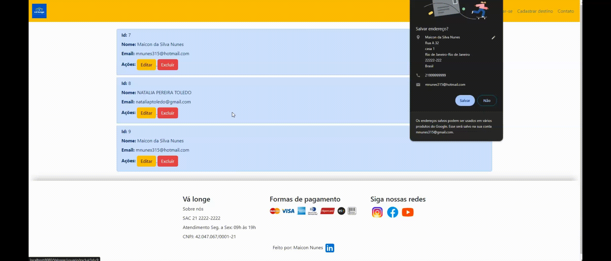
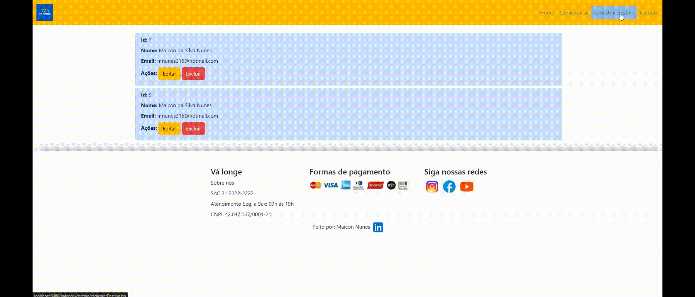
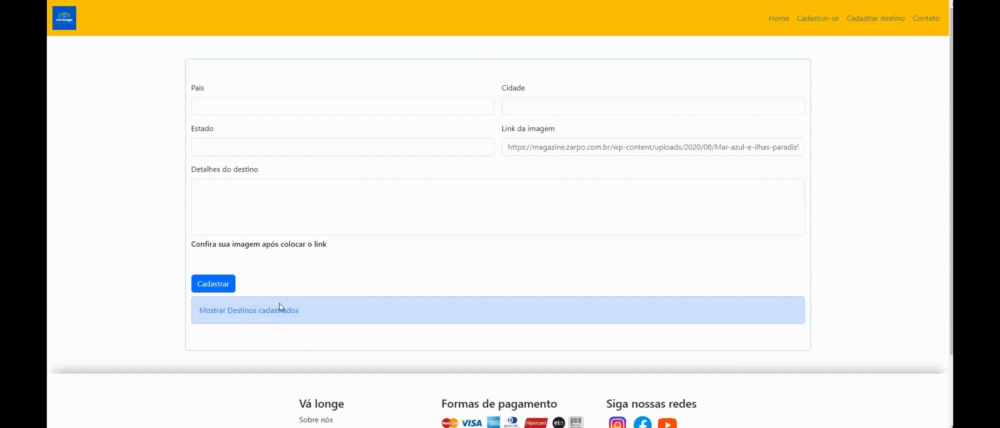

# CRUD - Agência de viagens

CRUD do site de agência de viagens com sistema MVC usando Java, Servelet, JSP e Mysql.

## Cadastrando Usuário

## Visualizando usuários cadastrado, editando e excluindo.

## Cadastrando destino

## visualizando destinos, editando e excluindo

## Backend Java
 * Criação de um menu intuitivo para interação com o CRUD da aplicação.
 * Usando servlet, servidor Tomcat 9.
 * Mysql.
## Frontend
1. JSP.

~~~
git clone https://github.com/MaiconNunes315/Entrega_Recode_4
~~~ 

Tecnologias Utilizadas
 * JSP
 * CSS
 * Bootstrap
 * Java
 * Mysql
 
